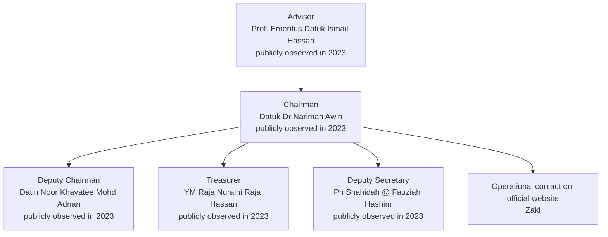
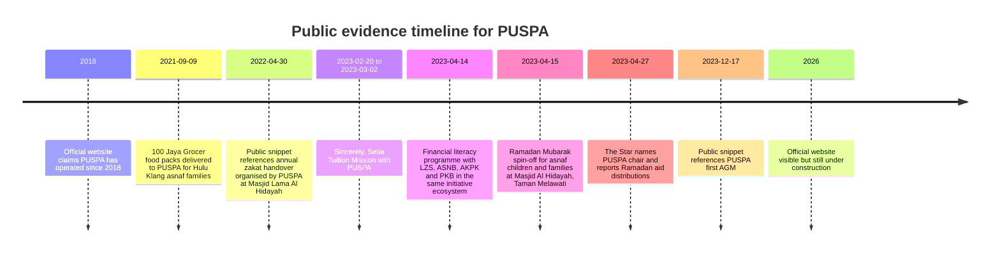

# PUSPA Pertubuhan Urus Peduli Asnaf in Kuala Lumpur and Selangor

## Executive summary

This review finds that **PUSPA is a real, publicly visible asnaf-focused charitable organisation**, with an official website, an indexed Facebook presence, and third-party activity records linking it to food aid and education-related community work in the Hulu Klang and Taman Melawati/Gombak area. The strongest externally corroborated evidence places PUSPA in public operations by **September 2021**, when Free Food Society recorded delivery of 100 Jaya Grocer food packs to PUSPA for asnaf families in Taman Permata, Taman Melawati, Kg Fajar and Klang Gate. In 2023, The Star and S P Setia/S P Setia Foundation materials documented a structured collaboration with PUSPA for a tuition mission and Ramadan aid programmes. citeturn39view0turn29view0turn31view0turn28view1

At the same time, **PUSPA’s public transparency is materially weak**. I did **not** locate, in accessible public internet sources, an **ROS registration number**, a downloadable **constitution/bylaws**, a **current board page**, an **annual report**, or any **audited financial statements**. The current official website is explicitly marked **“WEB IS UNDER CONSTRUCTION”**, publishes a donation bank account and contact details, and makes broad impact claims such as “5,000+ families supported” and “since 2018,” but those headline figures remain **self-reported** in this review unless otherwise noted. citeturn17view3turn33search1turn23search0

The most clearly evidenced funders and partners are **Perumahan Kinrara Berhad**, **S P Setia Foundation / S P Setia**, **Jaya Grocer**, **Free Food Society**, and **Kloth Cares / Kloth Circularity**. For **Lembaga Zakat Selangor**, **ASNB**, and **AKPK**, the public record shows they were strategic partners in a 2023 financial literacy programme associated with the same Setia Foundation asnaf initiative ecosystem, but the exact contractual relationship to PUSPA itself is not independently documented from those institutions’ own public pages in the materials found. I found **no direct public MAIWP record** naming PUSPA in the accessible sources reviewed. citeturn31view0turn29view0turn39view0turn32search1turn32search2

The leadership picture is also only **partially visible**. Public materials from 2023 identify **Datuk Dr Narimah Awin** as chair, **Datin Noor Khayatee Mohd Adnan** as deputy chair, **YM Raja Nuraini Raja Hassan** as treasurer, **Pn Shahidah @ Fauziah Hashim** as deputy secretary, and **Prof. Emeritus Datuk Ismail Hassan** as adviser. However, these roles are drawn from media and partner/social posts around 2023; the 2026 official site does not publish a current governing committee list. Accordingly, those leadership assignments are best treated as **publicly observed roles as of 2023**, not as definitively current. citeturn29view0turn34search2turn35search8

### Key data audit

| Datum | Best-supported finding | Provenance | Confidence |
|---|---|---|---|
| Legal/public name | **Pertubuhan Urus Peduli Asnaf**; acronym **PUSPA**. | Official website and third-party/partner references. citeturn17view3turn39view0turn29view0 | High |
| Geographic focus | Kuala Lumpur and Selangor generally; strongest repeated locality evidence is **Hulu Klang / Taman Permata / Taman Melawati / Kg Fajar / Klang Gate / Gombak**. | Official website plus Free Food Society and Setia/Star records. citeturn17view3turn39view0turn29view0turn38search3 | High |
| Year founded | Official website says **since 2018**; earliest independent public activity located in this review is **9 September 2021**. | 2018 is self-reported on official site; 2021 activity is third-party verified. citeturn17view3turn33search1turn39view0 | Medium for “active by 2021”; Low for “founded in 2018” |
| ROS number | **Not located** in accessible public sources reviewed. | ROS public search infrastructure confirmed, but no exact publicly retrievable PUSPA entry/number was obtained in this review. citeturn11view0turn33search15turn12search0 | Low |
| Official contact details | Address, email, phone, and contact name **“Zaki”** are published on the official website. | Official site. citeturn17view3 | High for “published contact”; Medium for “legal registered office” |
| Current board page | **Not found** on the official site. | Official site content reviewed. citeturn17view3 | High |
| Audited financial statements / annual reports | **Not found** in public web sources reviewed. | Official site and targeted search results did not surface these records. citeturn17view3turn23search0 | Medium |
| Strongest verified partner/funder | **Perumahan Kinrara Berhad / S P Setia Foundation**. | Multiple official and media corroborations. citeturn31view0turn28view1turn29view0turn28view0 | High |

## Evidence base and caveats

I prioritised **primary and near-primary public sources**: the official PUSPA website, the official Registry of Societies portal surfaces, official institutional sites for **LZS**, **MAIWP**, **MYNIC**, **LHDN**, and official or quasi-official partner publications from **S P Setia / S P Setia Foundation**. These were supplemented with mainstream media and third-party partner records such as **The Star** and **Free Food Society**. Where a fact appeared only on PUSPA’s own site, I have labelled it **self-reported** unless independently corroborated. citeturn17view3turn11view0turn22search1turn36search5turn32search1turn32search2turn29view0turn39view0

One important caveat is **name ambiguity**. The acronym **PUSPA** is also used by unrelated entities, including a UniSZA academic unit and another organisation in Kelantan that is **not** Pertubuhan Urus Peduli Asnaf. That means exact-name verification matters; many generic “PUSPA” search results are noise and should not be attributed to this organisation. citeturn20search27turn35search11

A second caveat is that some useful public evidence is trapped in **social media snippets**, especially Facebook. Those snippets are still valuable when the search engine exposes page titles, dates, names and role descriptions, but they carry lower evidentiary weight than an official PDF, registry extract, or signed annual report. I therefore distinguish carefully between **official publication**, **partner publication**, **mainstream media**, and **indexed social snippet**. citeturn33search2turn34search2turn35search8

A third caveat concerns **registry and domain transparency**. The ROS public search system is publicly accessible, but this review was unable to retrieve a direct, exact PUSPA registry entry or ROS number from accessible indexed materials. For the domain, MYNIC is the official `.MY` registry, but it restricts access to certain registrant details; its published FAQ states that information not readily available on WHOIS is limited to authorised law-enforcement requests. That means domain ownership cannot be independently confirmed from public WHOIS alone in the way users might expect for some generic top-level domains. citeturn11view0turn33search15turn22search1turn22search8

## Verified organisational profile

### Identity, public footprint, and registration status

The official website identifies the organisation as **Pertubuhan Urus Peduli Asnaf (PUSPA)** and says it supports asnaf families in **Kuala Lumpur and Selangor**. The site also claims PUSPA has operated **“since 2018”** and displays the top-line metric **“7 years of service”** as of 2026. Those claims are internally consistent, but in this review they remain **self-reported**, because I did not find a public 2018 founding document or ROS certificate. citeturn17view3turn33search1

The earliest independent public evidence I located is a **Free Food Society** project entry dated **2 October 2021**, stating that on **9 September** 100 Jaya Grocer food packs were delivered to PUSPA, and describing PUSPA’s service geography as Hulu Klang, especially **Taman Permata, Taman Melawati, Kg Fajar and Klang Gate**. That makes **active public operations by September 2021** highly plausible. citeturn39view0

On registration, the ROS portal clearly provides a public **Semakan Status Pertubuhan** function, and the public search page was accessible during this review. However, I could not retrieve an exact public ROS number or a directly indexable registry listing for PUSPA from the accessible sources reviewed here. Because non-retrieval is not the same as proof of non-registration, the correct conclusion is **“registration number not independently verified from public-accessible materials in this review”**, not “unregistered.” citeturn11view0turn33search15turn12search0

### Official contact details

The strongest contact details come from PUSPA’s own website. These should be treated as **officially published contact details**, but not automatically as proof of the legally registered office. citeturn17view3

| Contact field | Published detail | Provenance | Confidence |
|---|---|---|---|
| Street address | **2253, Jalan Permata 22, Taman Permata, 53300 Gombak, Selangor** | Official website. citeturn17view3 | High as published contact; Medium as legal registered office |
| Email | **salam.puspaKL@gmail.com** | Official website. citeturn17view3 | High |
| Phone | **+6012-3183369** | Official website. citeturn17view3 | High |
| Named contact | **Zaki** | Official website lists this beside the phone number, but without a formal title. citeturn17view3 | Medium |
| Donation bank account | **Maybank 562209677503** | Official website donation section. Ownership of the account was not independently verified in this review. citeturn17view3 | Medium |

### Public digital presence

The official website is reachable at `puspa.org.my` and, as reviewed, is explicitly labelled **“WEB IS UNDER CONSTRUCTION.”** It links outward to **TikTok**, but the website HTML visible in this review does **not** expose a readable TikTok handle. The site does **not** visibly list Facebook, Instagram or LinkedIn outbound links in the page text that was accessible here. citeturn17view3

An indexed Facebook page exists with the title **“Pertubuhan Urus Peduli Asnaf KL & Selangor”**, and search-engine snippets describe it as a welfare body formed to empower the asnaf community. That is useful corroboration that PUSPA maintained a Facebook presence, although Facebook snippet evidence is still weaker than a directly accessible official corporate page. citeturn33search2turn35search10

### Leadership and public organisational structure

The strongest publicly visible leadership evidence comes from 2023 media and partner/social postings, not from PUSPA’s current official website. The Star’s April 2023 report names **Datuk Dr Narimah Awin** as PUSPA chairman. A separately indexed S P Setia Facebook snippet from the same period names **Prof. Emeritus Datuk Ismail Hassan** as adviser, **Datin Noor Khayatee Mohd Adnan** as deputy chairman, **YM Raja Nuraini Raja Hassan** as treasurer, and **Pn Shahidah @ Fauziah Hashim** as deputy secretary. A December 2023 Facebook snippet also refers to Noor Khayatee as deputy chair and mentions PUSPA’s **first AGM** on **17 December 2023**. citeturn29view0turn34search2turn35search8

| Publicly observed role | Name | Evidence | Provenance | Confidence |
|---|---|---|---|---|
| Chairman | **Datuk Dr Narimah Awin** | Named in The Star report on April 2023 Ramadan aid event. | Mainstream media. citeturn29view0 | High for role in Apr 2023 |
| Deputy Chairman | **Datin Noor Khayatee Mohd Adnan** | Named in indexed S P Setia Facebook snippet; also referenced in Dec 2023 AGM snippet. | Partner social snippet. citeturn34search2turn35search8 | Medium |
| Treasurer | **YM Raja Nuraini Raja Hassan** | Named in indexed S P Setia Facebook snippet. | Partner social snippet. citeturn34search2 | Medium |
| Deputy Secretary | **Pn Shahidah @ Fauziah Hashim** | Named in indexed S P Setia Facebook snippet. | Partner social snippet. citeturn34search2 | Medium |
| Adviser | **Prof. Emeritus Datuk Ismail Hassan** | Named in indexed S P Setia Facebook snippet. | Partner social snippet. citeturn34search2 | Medium |
| Operational contact | **Zaki** | Name shown on official website next to phone number. | Official website. citeturn17view3 | Medium |



The chart above is a **reconstruction from public evidence**, not an official organisation chart published by PUSPA. The names and roles come from The Star and indexed partner/social records from 2023, while the official website only exposes an operational contact name. citeturn29view0turn34search2turn17view3

### Governance, board records, constitution, and filings

Public governance disclosure is minimal. I did **not** locate on the official site a current board page, downloadable constitution/bylaws, AGM minutes, annual return summary, code of conduct, conflict-of-interest policy, or procurement policy. The only governance-adjacent public trace I found was the December 2023 snippet referring to PUSPA’s **first AGM**. citeturn17view3turn35search8

This matters because ROS/JPPM clearly positions itself as the government body that administers the registration and management of societies, and its public services include status-checking and management guidance. Yet none of the key society records that a researcher would normally want for due diligence were publicly retrievable for PUSPA in this review. citeturn9search0turn11view0turn9search7

## Programmes, partnerships, and externally visible activity

### Programmes with primary or near-primary evidence

Below is the most defensible public programme inventory I could build from primary and near-primary materials. I exclude generic website metrics from this table unless they can be tied to a date, place, or outside corroboration.

| Date | Programme / event | Location | Beneficiaries / KPI | Provenance and verification note | Confidence |
|---|---|---|---|---|---|
| **9 Sep 2021** | Food-pack distribution via PUSPA | Hulu Klang, especially **Taman Permata, Taman Melawati, Kg Fajar, Klang Gate** | **100 food packs** donated by Jaya Grocer delivered to PUSPA | Free Food Society project page; third-party corroboration of PUSPA activity and service geography. citeturn39view0 | High |
| **30 Apr 2022** | Annual zakat handover to asnaf organised by PUSPA | **Masjid Lama Al Hidayah, Taman Melawati** | Amount not stated in accessible snippet | Indexed post by JKP Zon 3 MPAJ says councillor attended a zakat handover organised by PUSPA. Because it is a Facebook snippet and the full content could not be fetched, this is useful but lower-strength evidence. citeturn38search9 | Medium |
| **20 Feb–2 Mar 2023** | **Sincerely, Setia Tuition Mission** for asnaf children | Tuition centre / Dewan Serbaguna MPAJ, Gombak | Dates and subjects verified; headcount not clearly stated in the accessible official lines | Official Setia Foundation impact page says the programme ran from 20 Feb to 2 Mar 2023 and covered English, Bahasa Melayu, Mathematics, extracurricular and life-skill activities for asnaf children referred by PUSPA; indexed S P Setia snippet places the classes at Dewan Serbaguna MPAJ, Gombak. citeturn31view0turn38search3turn34search5 | High for dates/topics/location; Medium for full KPI count |
| **14 Apr 2023** | **Sincerely, Setia Ramadan Mubarak: Financial Literacy** | Not clearly specified in accessible lines | **80** asnaf individuals; **RM300 per pax** zakat; **RM80** basket; **20** volunteers; **100** volunteer hours | Official Setia Foundation impact page. This programme is linked to the same asnaf initiative ecosystem and strategic partners **LZS, ASNB, AKPK, PKB**, but the accessible lines do not explicitly state PUSPA’s direct operational role in this specific sub-programme; treat as **PUSPA-adjacent rather than conclusively PUSPA-run**. citeturn31view0 | Medium |
| **15 Apr 2023** | **Sincerely, Setia Ramadan Mubarak with Asnaf Children & Families** | **Masjid Al Hidayah, Taman Melawati** | **162** asnaf children and family members; **20** volunteers; **80** volunteer hours | Official Setia Foundation impact page. Described as a spin-off from the Tuition Mission done with PUSPA. citeturn31view0 | High |
| **27 Apr 2023** | Press coverage of Ramadan aid event | Taman Melawati / Masjid Al-Hidayah | The Star reports **more than 160** adults and children; **122** curtain sets; **122 adults** and **40 children** were separately referenced in the article | Independent mainstream media corroboration of the 15 April 2023 programme, including PUSPA chair presence and PKB zakat funding. citeturn29view0 | High |
| **17 Dec 2023** | First AGM | Not stated in accessible snippet | Governance event rather than beneficiary KPI | Indexed public Facebook snippet referring to PUSPA’s first AGM. citeturn35search8 | Medium |

### Claimed programme portfolio on the official website

The official website presents a broader programme architecture — **Food Aid, Education Support, Skills Training, Healthcare Support, Financial Assistance** — with headline metrics. These figures are useful as indicators of how PUSPA wants donors to understand its mission, but they remain **self-reported** in this review. citeturn17view3turn33search1

| Official programme claim | Website metric | Independent corroboration located? | Assessment |
|---|---|---|---|
| Food Aid | **1,200+ families**, monthly distribution, **15 locations** | I found independent evidence for one **100-pack** distribution in 2021 and multiple 2023 Ramadan distributions, but not enough to verify the aggregate metric. citeturn17view3turn39view0turn29view0 | **Self-reported** |
| Education Support | **850+ students**, **50+ tutors**, **95% pass rate** | External evidence confirms a 2023 tuition collaboration, but not these aggregate totals or pass-rate calculations. citeturn17view3turn31view0turn38search3 | **Self-reported** |
| Skills Training | **300+ participants**, **12 courses**, **70% employment** | No independent public dataset, report, or partner statement found to verify these totals. citeturn17view3 | **Self-reported** |
| Healthcare Support | **2,000+ beneficiaries**, **25+ doctors**, quarterly checkups | No independently retrievable partner or medical-camp report was found to verify the aggregate metric. citeturn17view3 | **Self-reported** |
| Overall impact | **5,000+ families supported**, **100+ active volunteers**, **25+ community programmes**, **7 years of service** | The review confirms public activity and some volunteer-hour figures inside Setia-linked programmes, but not the aggregate totals. The “since 2018 / 7 years” claim is not independently proven. citeturn17view3turn33search1turn31view0turn39view0 | **Self-reported** |

### Verified funders, donors, and partners

| Organisation | Role in relation to PUSPA | Evidence | Confidence |
|---|---|---|---|
| **Perumahan Kinrara Berhad** | **Major verified funder** through zakat in 2023 tuition/Ramadan programmes; also named as zakat contributor in 2026 Setia programme ecosystem | Official Setia Foundation impact page, official Setia news, and The Star. citeturn31view0turn28view1turn28view0turn29view0 | High |
| **S P Setia Foundation / S P Setia** | **Major verified partner and organiser** in tuition and Ramadan initiatives involving PUSPA | Official Setia Foundation and The Star. citeturn31view0turn28view1turn29view0 | High |
| **Jaya Grocer** | Verified donor of **100 food packs** in Sep 2021 | Free Food Society project page. citeturn39view0 | High |
| **Free Food Society** | Verified third-party distribution/documentation partner | Free Food Society project page. citeturn39view0 | High |
| **Kloth Cares / Kloth Circularity** | Verified programme partner in 2023 upcycled curtain distribution | The Star and S P Setia Facebook snippet. citeturn29view0turn35search5 | High |
| **Lembaga Zakat Selangor** | Strategic partner in 2023 financial-literacy programme within the same asnaf initiative ecosystem; direct bilateral PUSPA arrangement not independently established from LZS’s own public pages | Official Setia Foundation impact page; no direct LZS page naming PUSPA found. citeturn31view0turn32search2 | Medium |
| **ASNB** | Same as above | Official Setia Foundation impact page. citeturn31view0 | Medium |
| **AKPK** | Same as above | Official Setia Foundation impact page. citeturn31view0 | Medium |
| **MAIWP** | No direct public PUSPA partnership record located in accessible sources reviewed | MAIWP pages reviewed were general assistance pages and did not name PUSPA. citeturn32search1turn32search3 | Low for partnership claim |

The partnership pattern suggests that **PUSPA’s strongest evidenced operating model is local beneficiary identification and community delivery**, while larger corporate or zakat-linked institutions fund, co-design, or publicly frame the programmes. That is an inference from the evidence above, not an official PUSPA organisational statement. citeturn31view0turn29view0turn39view0

## Financial disclosure and transparency assessment

### Audited financials, annual reports, and donor transparency

I found **no publicly available audited financial statements** or **annual reports** for PUSPA on its official website or through targeted public web searches. That is a significant due-diligence gap. By contrast, partner organisations such as S P Setia Foundation make programme-level impact information public on their own sites, which is why the best verified quantitative evidence about PUSPA often comes from **partners**, not PUSPA itself. citeturn23search0turn17view3turn31view0turn28view2

The official PUSPA site does publish a **Maybank account number** and states that donors will receive a receipt, but it does **not** publish audited receipts, a donation policy, tax-deductibility status, year-by-year income/expenditure, or a list of major donors. LHDN clearly maintains official donation-approval and donation-receipt guidance for eligible institutions, yet I found no public evidence in accessible sources that PUSPA holds a published LHDN approval status. citeturn17view3turn36search5turn36search20

### Claimed versus verified financial and impact metrics

| Metric or disclosure item | Public claim / public absence | Independent status in this review | Provenance | Confidence |
|---|---|---|---|---|
| Financial statements | No public audited accounts found | **Unresolved / absent from accessible public web** | Official site and targeted search results. citeturn17view3turn23search0 | Medium |
| Annual reports | No annual reports found | **Unresolved / absent from accessible public web** | Official site and targeted search results. citeturn17view3turn23search0 | Medium |
| Donation channel | Maybank account published | Account number is published, but ownership and reconciliation not independently verified | Official site. citeturn17view3 | Medium |
| Donor list | No structured donor list found | Only programme-level donors/partners could be reconstructed from partner/media sources | Official site, FFS, Setia, The Star. citeturn17view3turn39view0turn29view0turn31view0 | High for absence of published donor page; Medium for completeness of reconstructed donor map |
| Total families supported | “5,000+” | Not independently verified | Official website only. citeturn17view3turn33search1 | Low |
| Active volunteers | “100+” | Not independently verified, though some joint programmes have verified volunteer-hour counts | Official website plus Setia programme pages. citeturn17view3turn31view0 | Low |
| Years of service | “7” / since 2018 | Earliest public external activity located is Sep 2021 | Official website and Free Food Society. citeturn17view3turn39view0 | Low for 2018 claim; High for 2021 activity |

Overall, on public transparency grounds, I would classify PUSPA as **operationally visible but disclosure-light**. The organisation appears active and community-embedded, but it does **not** yet provide the standard record set that would allow a donor, researcher, or university reviewer to independently test its historical scale, financial stewardship, or governance robustness. citeturn17view3turn39view0turn29view0turn31view0

## Media chronology and third-party verification

The public evidence trail is thin but coherent. It starts with a 2021 food-aid distribution recorded by Free Food Society, shows a 2022 zakat handover referenced on an MPAJ councillor page, and becomes strongest in 2023, when Setia Foundation and The Star documented a tuition mission and Ramadan aid work with PUSPA. Exact-name searches of major Malaysian outlets in this review surfaced a clear **The Star** hit, while equivalent exact-name searches did **not** surface direct PUSPA articles from Malay Mail or NST in the results retrieved here. citeturn39view0turn38search9turn31view0turn29view0turn40search0



The timeline above combines official, media, partner and indexed-social evidence. The strongest points are the 2021 Free Food Society record, the 2023 Setia Foundation records, and The Star’s April 2023 report. The 2018 “since 2018” claim remains self-reported; the 2022 and December 2023 entries rely on social snippets and therefore carry lower evidentiary weight. citeturn39view0turn31view0turn29view0turn38search9turn35search8turn17view3

### What is independently verified, and what remains unresolved

**Independently or strongly corroborated:** PUSPA’s existence as an operating asnaf-focused group; geographic activity around Hulu Klang/Taman Melawati/Gombak; one 2021 food distribution; a 2023 Setia/PKB tuition collaboration; a 2023 Ramadan aid collaboration; and the public identification of Datuk Dr Narimah Awin as chair in April 2023. citeturn39view0turn31view0turn29view0

**Still unresolved or weakly evidenced:** exact ROS registration number; current ROS status; current office-bearer list as of 2026; constitution/bylaws; audited financials; annual reports; tax-deductibility status; and verification of the official website’s large aggregate programme metrics. citeturn11view0turn17view3turn23search0turn36search5

## Recommendations for validation and stronger transparency

### For immediate validation of PUSPA’s legitimacy

**Request the ROS certificate and constitution directly from PUSPA.** The fastest single validation step is to ask PUSPA for a copy of its **ROS registration certificate**, exact registered name, ROS number, and constitution/bylaws. The current public website provides an email address and phone number, which makes a direct records request feasible. citeturn17view3

**Cross-check with JPPM/ROS using the exact registered name.** The ROS portal provides a public “Semakan Status Pertubuhan” service and official JPPM contact channels. A formal follow-up should insist on the exact legal spelling, state code, and registration number used by the society. citeturn11view0turn9search9

**Ask PUSPA to confirm whether the Taman Permata address is its registered office or only its operating contact address.** The site publishes the address as a contact point, but not explicitly as the registered office. citeturn17view3

### For financial due diligence

**Request audited statements or, if unaudited, at minimum management accounts and bank signatory details.** Public sources currently do not provide annual accounts. The published Maybank account should be matched against a bank confirmation letter or board-approved banking resolution before any substantial donation or research endorsement. citeturn17view3turn23search0

**Request evidence of donor-receipt and tax status.** Since the website promises donation receipts, PUSPA should be asked to show a sample receipt format, whether donations are tax deductible, and whether any LHDN approval exists. LHDN’s official donation-approval and donation-receipt pages provide the relevant benchmark for what a compliant disclosure package should look like. citeturn36search5turn36search20

### For programme verification

**Obtain beneficiary master lists and KPI methodology for every published headline figure.** PUSPA’s site should explain how “families supported,” “pass rate,” “employment,” and “beneficiaries” are defined and counted, over what time period, and whether totals are cumulative or annual. Right now these metrics are visible but not methodologically transparent. citeturn17view3turn33search1

**Seek written confirmation from partners named in public records.** The cleanest way to validate 2023 programme claims is to request letters or emails from **S P Setia Foundation**, **Perumahan Kinrara Berhad**, and, where relevant, **LZS/ASNB/AKPK**, confirming PUSPA’s role, beneficiary numbers, and the exact nature of the collaboration. Public Setia materials are already detailed enough to anchor such verification. citeturn31view0turn28view1turn28view0

### For long-term transparency improvement

**Publish a current governing committee page.** PUSPA should list office-bearers, appointment dates, and role descriptions on its own site. Today, the best public leadership evidence comes from 2023 partner/media records rather than PUSPA’s own governance disclosures. citeturn29view0turn34search2turn17view3

**Publish an annual report and audited financial statements each year.** Even a concise report with programme counts, donor categories, finance summary, governance notes, and partner letters would materially improve credibility and reduce reliance on reconstructing the organisation through partners’ websites. citeturn17view3turn23search0

**Separate self-reported impact from externally verified impact.** A strong practice would be to maintain two columns on the website: “reported by PUSPA” and “externally verified/partner-certified.” This would immediately improve the evidentiary quality of public claims and make university-level review much easier. citeturn17view3turn31view0turn29view0

## Direct source links

The URLs below are the most important primary and corroborating sources used in this review.

```text
PUSPA official website
https://puspa.org.my/

Registry of Societies Malaysia official portal
https://www.ros.gov.my/

ROS public status-check page
https://www.ros.gov.my/portal-main/semakan2

ROS semakan gateway
https://semakan.ros.gov.my/public/

MYNIC WHOIS
https://mynic.my/whois

Lembaga Zakat Selangor Asnaf Development
https://www.zakatselangor.com.my/en/asnaf-development/
https://www.zakatselangor.com.my/pembangunan-asnaf/

MAIWP main portal
https://www.maiwp.gov.my/
https://www.maiwp.gov.my/portal-main/home

LHDN donation approval
https://www.hasil.gov.my/en/quick-links/services/donation-approval/
https://www.hasil.gov.my/en/institutionsorganizationsfunds-primarily-is-not-for-profit/donation-receipts/

Free Food Society project page on PUSPA
https://www.freefoodsociety.my/02-october-2021-food-packs-for-asnaf-families-in-hulu-klang/

The Star report naming PUSPA chair and collaboration
https://www.thestar.com.my/metro/metro-news/2023/04/27/contributions-to-meet-needs-of-the-poor

S P Setia Foundation overview
https://spsetia.com/s-p-setia-foundation/

S P Setia Foundation impact page containing PUSPA-linked programme data
https://spsetia.com/zh/s-p-setia-foundation/impact-inner/

S P Setia article referencing prior PUSPA Tuition Mission collaboration
https://spsetia.com/news/s-p-setia-foundation-provides-spm-workshop-in-sabah/

S P Setia / EdgeProp-hosted 2026 Ramadan programme article
https://spsetia.com/news/setia-foundation-reaches-out-to-asnaf-community-via-sincerely-setia-ramadan-mubarak-programme/

Indexed Facebook page for PUSPA
https://www.facebook.com/Pertubuhan-Urus-Peduli-Asnaf-KL-Selangor-108917598420983/photos/a.151736600805749/151736540805755/

Indexed S P Setia Facebook snippet naming PUSPA office-bearers
https://www.facebook.com/spsetia/posts/5969247343118867/
https://www.facebook.com/spsetia/posts/dato-zuraidah-atan-chairman-of-setia-foundation-together-with-management-committ/5969247343118867/

Indexed MPAJ councillor post referencing a 2022 PUSPA zakat event
https://www.facebook.com/Zon3MPAJ/posts/366626182076136/

Indexed post referencing PUSPA first AGM
https://www.facebook.com/ADNBukitMelawati/posts/mesyuarat-agung-pertama-pertubuhan-peduli-asnaf-kl-dan-selangor17-disember-2023-/863283192468985/
```

### Bottom-line assessment

On the evidence publicly available online, **PUSPA appears to be a genuine grassroots asnaf-focused organisation with documented activity and credible partner associations**, especially in the Hulu Klang/Taman Melawati/Gombak corridor. However, its **public accountability stack is incomplete**: the organisation does not currently expose the registry, governance, and financial documents that would normally support a full university-grade compliance or impact review. Until PUSPA publishes or supplies those records, its core existence and community work should be treated as **verified**, while its larger impact claims and formal governance credentials remain **partly or largely unverified in the public domain**. citeturn39view0turn29view0turn31view0turn17view3turn23search0